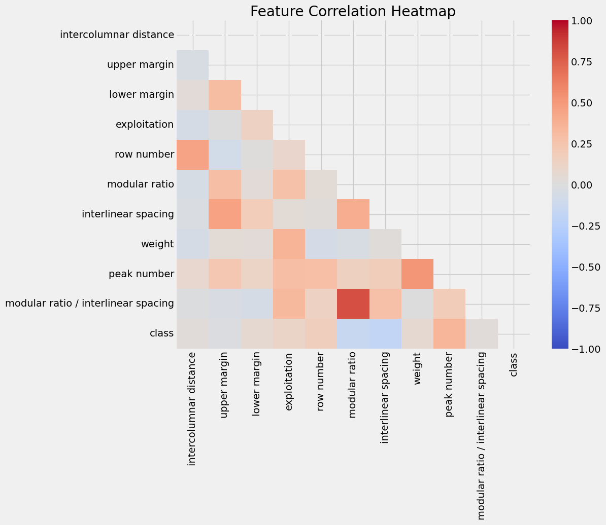
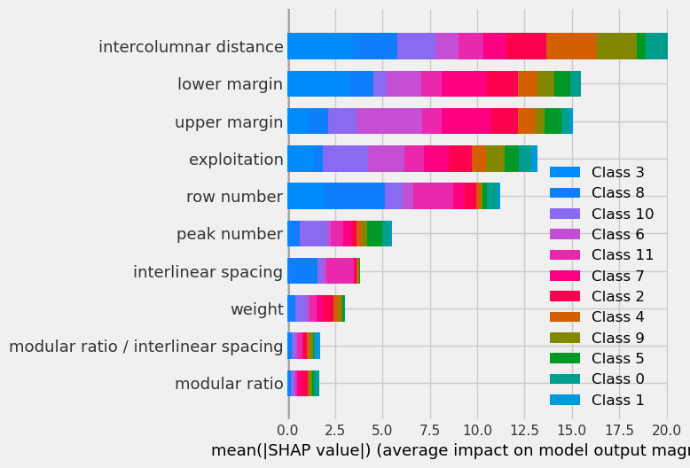

# Data-Analysis-Project
## Avila Bible Copyist Classification

4th year final project for "Python for Data Analysis" class.

This project focuses on **classifying** the copyists of the Avila Bible, a 12th-century Latin Bible manuscript. The dataset, derived from 800 images of the manuscript, contains patterns with 10 features. The task is to associate each pattern with one of the 12 copyists, labeled as A, B, C, D, E, F, G, H, I, W, X, or Y.

### Task Description

#### Dataset
The [dataset](https://archive.ics.uci.edu/dataset/459/avila) has been normalized using Z-normalization and is divided into a training set with 10,430 samples and a test set with 10,437 samples. Each pattern corresponds to a group of four consecutive rows in the manuscript.

#### Features
The 10 features include attributes like intercolumnar distance, upper margin, lower margin, exploitation, and others.

#### Class Distribution (Training Set)
- A: 4,286
- B: 5
- C: 103
- D: 352
- E: 1,095
- F: 1,961
- G: 446
- H: 519
- I: 831
- W: 44
- X: 522
- Y: 266

### Dependencies
List of dependencies required to run the project.
* PIP
```
pip install matplotlib seaborn pandas numpy panel plotly xgboost scikit-learn shap
```
* Conda
```
conda install -c conda-forge matplotlib seaborn pandas numpy panel plotly xgboost scikit-learn shap
```

### Task Progress

#### Data Pre-processing
According to the provided documentation, the training and test datasets have already been split and normalized (with Z-normalization). I encoded the class labels into numerical values. The data cleaning was not needed as there was no missing values, and they were in the right format.\
These steps ensure that the data is ready for modeling.

#### Data Visualization



#### Modeling



#### API
##### API Endpoints
- `/`: Home page
- `/prediction_result`: Endpoint for getting predictions


### Conclusions
***to do***

#### Citations

C. De Stefano, M. Maniaci, F. Fontanella, A. Scotto di Freca, Reliable writer identification in medieval manuscripts through page layout features: The "Avila" Bible case, Engineering Applications of Artificial Intelligence, Volume 72, 2018, pp. 99-110.
