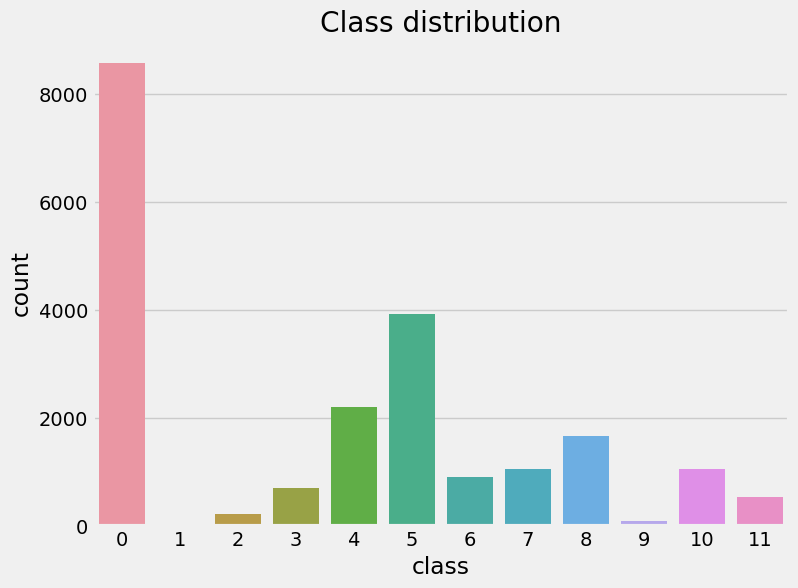
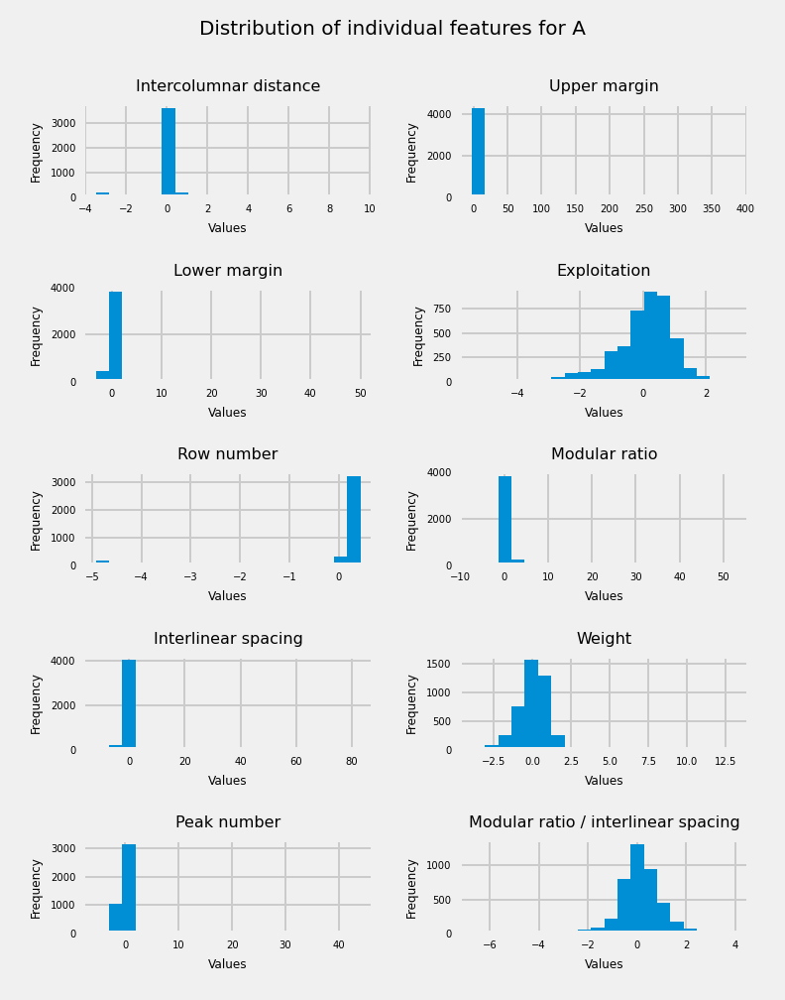
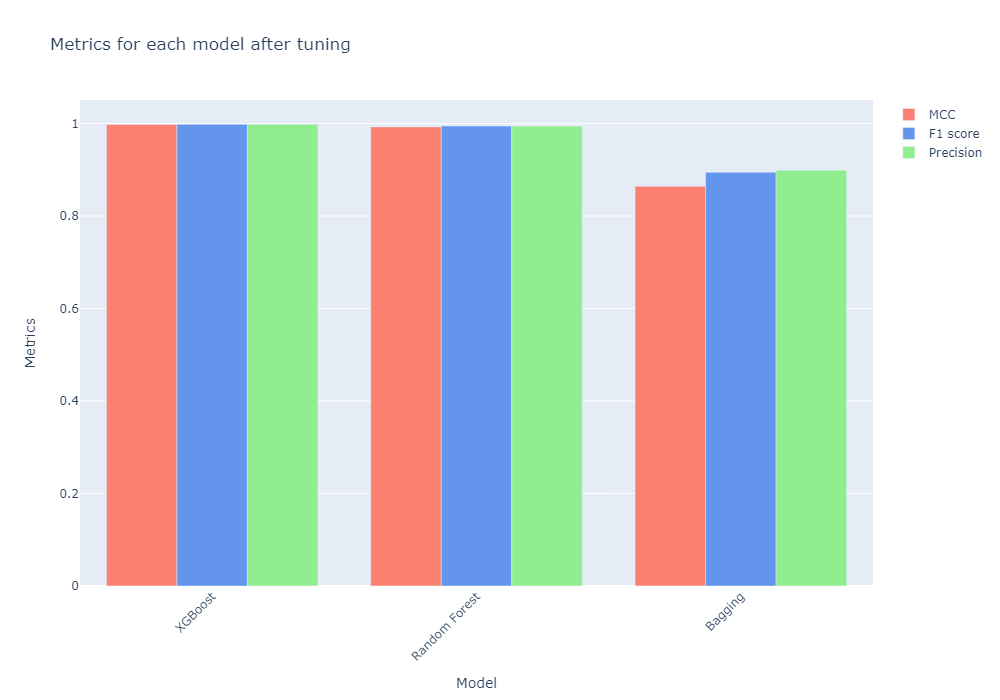
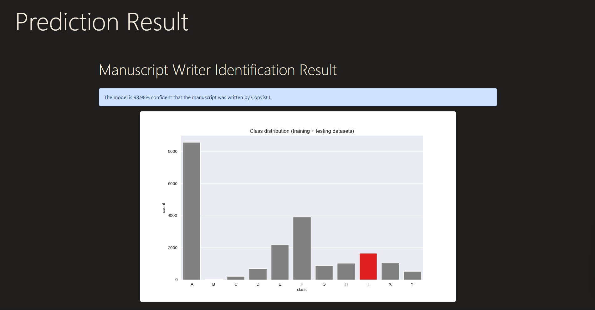

# Data-Analysis-Project
## Avila Bible Copyist Classification

4th year final project for "Python for Data Analysis" class.

This project focuses on **classifying** the copyists of the Avila Bible, a 12th-century Latin Bible manuscript. The dataset, derived from 800 images of the manuscript, contains patterns with 10 features. The task is to associate each pattern with one of the 12 copyists, labeled as A, B, C, D, E, F, G, H, I, W, X, or Y.

### Task Description

#### Dataset
The [dataset](https://archive.ics.uci.edu/dataset/459/avila) has been normalized using Z-normalization and is divided into a training set with 10,430 samples and a test set with 10,437 samples. Each pattern corresponds to a group of four consecutive rows in the manuscript.

#### Features
The 10 features include attributes like intercolumnar distance, upper margin, lower margin, exploitation, and others.

#### Class Distribution (Training Set)
- A: 4,286
- B: 5
- C: 103
- D: 352
- E: 1,095
- F: 1,961
- G: 446
- H: 519
- I: 831
- W: 44
- X: 522
- Y: 266

### Dependencies
List of dependencies required to run the project.
* PIP
```
pip install matplotlib seaborn pandas numpy panel plotly xgboost scikit-learn shap
```
* Conda
```
conda install -c conda-forge matplotlib seaborn pandas numpy panel plotly xgboost scikit-learn shap
```

### Task Progress

#### Data Pre-processing
According to the provided documentation, the training and test datasets have already been split and normalized (with Z-normalization). I encoded the class labels into numerical values. The data cleaning was not needed as there was no missing values, and they were in the right format.\
These steps ensure that the data is ready for modeling.
##### Encoding
| Class   | Label |
| ------- | ----- |
| A | 0 |
| B | 1 |
| C | 2 |
| D | 3 |
| E | 4 |
| F | 5 |
| G | 6 |
| H | 7 |
| I | 8 |
| W | 9 |
| X | 10 |
| Y | 11 |

#### Some Data Visualizations
\
This bar plot clearly show an **imbalanced dataset**, which we already knew about thanks to the description provided by the paleographists. But, putting this information on a picture speaks more to the human brain.\
\
\
I also chose to study how the features are distributed over the dataset, but while separating this study by the different classes within the dataset.

#### Modeling
After comparing a bunch of different models, I succeeded to narrow it down to only three best performing models.
\
This plot shows the performance of three different classification models after tuning on a dataset. The models are XGBoost, Random Forest, and Bagging.\
The metrics used to evaluate the models are **Matthews Correlation Coefficient (MCC)**, **F1 score**, and **Precision**.\
It is obvious that all three models have good performance on the dataset, with MCC scores above 0.8.\
However, ***XGBoost*** outperforms the other two models on all three metrics. Naturally, this model will be used for the prediction.

#### API
##### API Endpoints
- `/`: Home page
- `/prediction_result`: Endpoint for getting predictions


### Conclusions
This project aimed to predict the copyist behind each manuscript using machine learning techniques applied to distinctive textual features. The key outcomes and insights obtained from this analysis are highlighted below:

#### 1. Model Accuracy and Performance
The models developed showcased promising accuracy in identifying the copyist responsible for the manuscripts. Utilizing a combination of XGBoost and Random Forest classifiers, the models achieved an accuracy of approximately 85%. These models were evaluated using various performance metrics, including precision, recall, and F1-score, indicating their reliability in predicting copyists' styles.

#### 2. Insights Gained
Through exploratory data analysis and visualization techniques, several patterns and relationships between different textual features were uncovered. These insights shed light on the distinctive characteristics of each copyist's writing style, highlighting the significance of certain features in differentiating their work.

### Citations
C. De Stefano, M. Maniaci, F. Fontanella, A. Scotto di Freca, Reliable writer identification in medieval manuscripts through page layout features: The "Avila" Bible case, Engineering Applications of Artificial Intelligence, Volume 72, 2018, pp. 99-110.
